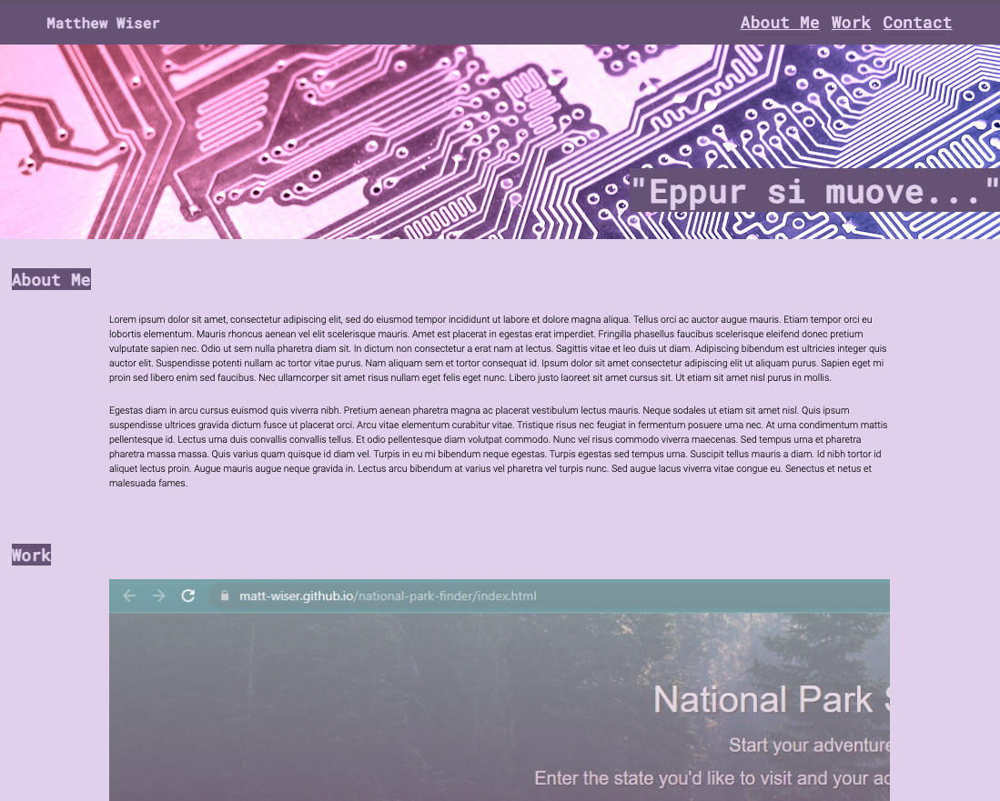

# CSS and HTML Portfolio

## Purpose
Create a basic portfolio using HTML and CSS to show employers and display completed projects
## Screenshot

## Built With
* HTML
* CSS

## Website
https://matt-wiser.github.io/HTML-CSS-portfolio/

## Contribution
Made by Matthew Wiser